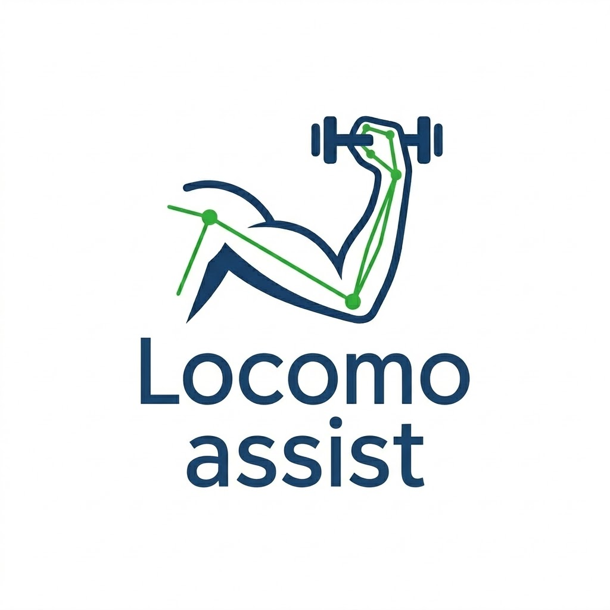
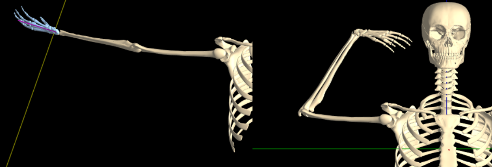
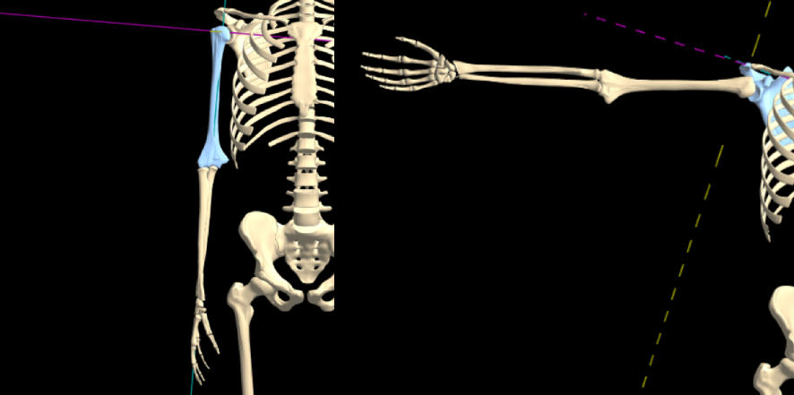

<div align="center">
  <h1>LocomoAssist</h1>
  
  <p><strong>Un kinésithérapeute virtuel dans votre poche.</strong></p>
  <p>
    
    
    
    
    
  </p>
</div>

---

## Le problème

Chaque année au Togo, des milliers de vies basculent. Les AVC représentent la première cause de handicap moteur acquis chez l'adulte dans les centres hospitaliers de Lomé. À cela s'ajoute une explosion des traumatismes : plus de 60 % des accidents de la route au Togo impliquent des engins à deux-roues.

Ces patients ont un besoin vital de rééducation des membres. Mais la rééducation physique souffre de trois problèmes majeurs :

**Un mur financier.** Une séance de kinésithérapie coûte entre 3 000 et 15 000 FCFA. Répétée plusieurs fois par semaine, cette charge mensuelle dépasse rapidement le SMIG togolais, forçant l'abandon des soins dans la majorité des cas faute de ressources.

**Le défi de la mobilité.** Transporter un patient hémiplégique ou lourdement blessé vers le CNAO ou les CHU aggrave ses douleurs, fatigue les familles et engendre des coûts de transport insoutenables.

**La solitude et l'erreur.** Entre deux rendez-vous médicaux, le patient fait ses exercices chez lui, souvent avec une mauvaise posture sans s'en rendre compte, ce qui peut aggraver sa situation. Le médecin n'a aucune donnée objective sur ce que le patient a réellement fait, et comment il l'a fait.

---

## La solution

> L'objectif n'est pas de remplacer le kinésithérapeute, dont l'expertise humaine et le diagnostic restent irremplaçables. Notre projet consiste à lui donner un allié technologique portable.

**LocomoAssist** est une **application desktop offline-first** de rééducation physique assistée par IA. Elle transforme n'importe quelle caméra de PC en un coach virtuel interactif, capable de guider le patient en temps réel et de générer des bilans cliniques précis pour les médecins — même sans connexion internet.

Elle repose sur trois piliers :

**L'œil intelligent (Computer Vision).** L'application utilise la caméra de l'appareil pour analyser instantanément les mouvements (angles articulaires, symétrie, compensation posturale) grâce à MediaPipe Pose embarqué localement — aucun envoi de données vidéo vers un serveur externe.

**Le coach vocal IA.** Pendant l'effort, une voix guide activement le patient. Elle le corrige en temps réel ("Redressez votre épaule gauche de quelques degrés"), l'encourage, et adapte son planning en fonction de sa fatigue ou de ses réussites. Quand une connexion est disponible, le coach utilise Groq API. Sans connexion, un système de règles expertes prend le relais sans interruption.

**Le hub clinique.** Toutes les données de performance sont compilées localement. L'application génère des rapports PDF qui traduisent les mouvements en constantes médicales (amplitude, régularité, progression), téléchargeables pour la prochaine consultation ou synchronisés vers le médecin quand une connexion est disponible.

---

## Pourquoi Electron — le changement de cette branche

La branche principale (`main`) est construite sur Next.js 14 déployé sur Vercel.

Cette branche (`desktop`) migre vers **Electron 32 + React + Vite** pour trois raisons concrètes liées au contexte togolais :

| Problème web | Solution desktop |
|---|---|
| Accès caméra soumis aux restrictions HTTPS du browser | Accès caméra natif, aucune restriction |
| MediaPipe dépend d'un CDN externe au chargement | Fichiers WASM embarqués localement dans l'app |
| Données perdues si la connexion coupe pendant une session | SQLite local — source de vérité permanente |
| Impossible de fonctionner sans internet | 100% fonctionnel offline, sync quand disponible |
| Déploiement = accès au web requis | Distribution en `.exe` — fonctionne sur tout PC Windows |

---

## Stack technique

### Application desktop

| Couche | Technologie |
|---|---|
| Shell desktop | Electron 32 |
| Frontend | React 18 + Vite 5 |
| Langage | TypeScript strict |
| UI | shadcn/ui + Tailwind CSS |
| State | Zustand |
| Détection de pose | MediaPipe Pose (WASM embarqué localement) |
| Canvas | API Canvas 2D native |
| Coach vocal | Web Speech API — voix française |
| Graphes | Recharts |
| PDF | PDFKit (main process Electron) |
| Formulaires | React Hook Form + Zod |

### Données

| Couche | Technologie |
|---|---|
| Base de données locale | SQLite via better-sqlite3 |
| ORM | Drizzle ORM |
| Sync cloud (optionnel) | Supabase — uniquement quand online |
| Communication main ↔ renderer | Electron IPC (contextBridge) |

### Coach IA

| Mode | Technologie |
|---|---|
| Online | Groq API — `llama-3.1-8b-instant` |
| Offline | Système de règles expertes embarqué |

### Build

| | |
|---|---|
| Packaging | electron-builder |
| Cibles | `.exe` (Windows), `.AppImage` (Linux), `.dmg` (macOS) |

---

## Architecture

```
locomo-assist/
├── electron/
│   ├── main.ts                  # Entry point Electron
│   ├── preload.ts               # contextBridge — API exposée au renderer
│   └── ipc/
│       ├── database.ts          # Handlers SQLite
│       ├── pdf.ts               # Génération PDF (PDFKit)
│       └── sync.ts              # Sync Supabase
│
├── src/                         # Application React
│   ├── pages/
│   │   ├── Dashboard.tsx
│   │   ├── SessionLive.tsx      # Cœur du produit
│   │   ├── Planning.tsx
│   │   ├── Progression.tsx
│   │   ├── Rapports.tsx
│   │   ├── Medecin.tsx
│   │   └── Parametres.tsx
│   ├── components/
│   │   ├── session/
│   │   │   ├── CameraFeed.tsx       # PIP webcam bas-gauche
│   │   │   ├── PoseCanvas.tsx       # Overlay landmarks MediaPipe
│   │   │   ├── SignalGraph.tsx      # Courbes -1000 à 1000
│   │   │   ├── RefVideoPlayer.tsx   # Vidéo de référence du geste
│   │   │   ├── AnglePanel.tsx       # Angles articulaires temps réel
│   │   │   ├── CoachPanel.tsx       # Feed messages coach IA
│   │   │   ├── ExerciseBar.tsx      # Barre progression exercices
│   │   │   └── SessionHistory.tsx
│   │   └── dashboard/
│   └── lib/
│       ├── mediapipe.ts             # Init WASM local
│       ├── angles.ts                # Calcul angles articulaires
│       ├── signal.ts                # Normalisation -1000/1000
│       ├── coach.ts                 # Groq + fallback offline
│       └── tts.ts                   # Web Speech API wrapper
│
├── drizzle/
│   ├── schema.ts                # Schéma Drizzle (SQLite)
│   └── seed.ts                  # 3 exercices initiaux
│
├── public/
│   └── mediapipe/               # Fichiers WASM embarqués
│
└── resources/
    └── exercises/               # Vidéos de référence MP4
        ├── elevation-laterale.mp4
        ├── abduction-bras.mp4
        └── flexion-coude.mp4
```

---

## Exercices disponibles

| Exercice | Partie du corps | Sets × Reps | Vidéo de référence |
|---|---|---|---|
| Élévation latérale du bras | Épaule | 3 × 10 | `elevation-laterale.mp4` |
| Abduction du bras | Épaule | 3 × 10 | `abduction-bras.mp4` |
| Flexion du coude | Coude | 3 × 12 | `flexion-coude.mp4` |

---

## Parcours utilisateur

**1. Planification.** L'application propose la session du jour avec les 3 exercices, une estimation de la durée et les zones musculaires sollicitées.

**2. Action.** Le patient lance la session. La caméra s'active. MediaPipe analyse sa posture en temps réel. Le coach vocal intervient pour corriger ou encourager. Les courbes de signal articulaire s'affichent en direct sur l'écran.

**3. Suivi.** À la fin de la session, un rapport PDF est généré localement. Il est téléchargeable immédiatement ou synchronisé vers le médecin référent dès qu'une connexion internet est disponible.

---

## Installation (développement)

### Prérequis

- **Node.js 20 LTS** — obligatoire (better-sqlite3 est incompatible avec Node 22+)
- Windows 10/11, macOS 12+, ou Linux

### 1. Cloner et installer

```bash
git clone https://github.com/MckEnthiam/locomo-assist.git
cd locomo-assist
git checkout desktop
npm install
```

### 2. Télécharger les fichiers WASM MediaPipe

```powershell
# Windows PowerShell
$base = "https://cdn.jsdelivr.net/npm/@mediapipe/pose"
$dest = "public\mediapipe"
New-Item -ItemType Directory -Force -Path $dest
$files = @(
  "pose_solution_packed_assets_loader.js",
  "pose_solution_simd_wasm_bin.js",
  "pose_solution_simd_wasm_bin.wasm",
  "pose_web.bss",
  "pose_web.data",
  "pose_web.js",
  "pose.binarypb",
  "pose_landmark_full.tflite",
  "pose_landmark_lite.tflite"
)
foreach ($f in $files) { Invoke-WebRequest "$base/$f" -OutFile "$dest\$f" }
```

### 3. Variables d'environnement

Créer un fichier `.env` à la racine :

```bash
VITE_GROQ_API_KEY=gsk_...
VITE_SUPABASE_URL=https://ton-projet.supabase.co
VITE_SUPABASE_ANON_KEY=...
SUPABASE_SERVICE_ROLE_KEY=...
```

> La clé Groq est optionnelle — l'app fonctionne offline sans elle.

### 4. Initialiser la base de données

```bash
npm run db:migrate
npm run db:seed
```

### 5. Lancer en développement

```bash
npm run dev
```

Cela lance simultanément Vite (renderer) et Electron (main process). Une fenêtre desktop s'ouvre.

---

## Build de distribution

```bash
npm run build          # Compile React + TypeScript
npm run electron:build # Package en .exe / .AppImage / .dmg
```

L'exécutable est généré dans `dist-electron/`.

---

## Équipe

| | Nom | Rôle |
|---|---|---|
| <a href="https://github.com/koumekpoablam3-ux"></a> | **KOUMEKPO Ablam Sotoh Rodrigue** | Chef de projet |
| <a href="https://github.com/MckEnthiam"></a> | **AKOSSOU Comlavi Didier Ethiam** | Développement |
| <a href="https://github.com/clairecodexx"></a> | **Claire** | Développement |

---

## Stack technique

### Frontend

| Couche | Technologie |
|---|---|
| Framework | Next.js 14 (App Router) |
| Langage | TypeScript strict |
| UI | shadcn/ui + Tailwind CSS |
| State | Zustand |
| Détection de pose | MediaPipe Pose (WASM) |
| Canvas | API Canvas 2D native |
| Coach vocal | Web Speech API (voix FR) |
| Graphes | Recharts |
| PDF client | jsPDF + jsPDF-AutoTable |
| Formulaires | React Hook Form + Zod |

### Backend

| Couche | Technologie |
|---|---|
| API | Next.js Route Handlers |
| Base de données | PostgreSQL via Supabase |
| ORM | Prisma |
| Coach IA | Groq API + Gemini API (alternance) |
| Génération PDF | PDFKit (Node.js) |
| Stockage | Supabase Storage |

### Infra

| | |
|---|---|
| Déploiement | Vercel |
| Linting | ESLint + Prettier |
| Pre-commit | Husky |

---

## Architecture

```
locomoassist/
├── app/
│   ├── page.tsx                    # Dashboard principal
│   ├── session/[exerciseId]/       # Vue session live
│   ├── planning/                   # Planning hebdomadaire
│   ├── progression/                # Graphes de progression
│   ├── rapports/                   # Rapports PDF
│   └── api/
│       ├── coach/                  # POST → API
│       ├── sessions/               # GET/POST sessions
│       ├── exercises/              # Catalogue d'exercices
│       ├── rapports/               # Génération PDF
│       └── progression/            # Données agrégées
├── components/
│   ├── session/
│   │   ├── CameraFeed.tsx          # Webcam PIP bas-gauche
│   │   ├── PoseCanvas.tsx          # Overlay MediaPipe
│   │   ├── SignalGraph.tsx         # Signal articulaire
│   │   ├── AnglePanel.tsx          # Angles en temps réel
│   │   └── CoachPanel.tsx          # Messages coach IA
│   └── dashboard/
├── lib/
│   ├── mediapipe.ts                # Init MediaPipe Pose
│   ├── angles.ts                   # Calcul angles articulaires
│   ├── coach.ts                    # Logique API
│   └── tts.ts                      # Web Speech API wrapper
└── store/
    ├── sessionStore.ts             # Etat session live (Zustand)
    └── progressionStore.ts
```

---

## Parcours utilisateur

**1. Planification.** L'IA propose au patient sa session du jour adaptée à sa forme, avec une estimation des mouvements, tensions et durée.

**2. Action.** Le patient pose son téléphone ou son PC, la caméra s'active, et l'IA commence à interagir vocalement avec lui tout au long des mouvements.

**3. Suivi.** A la fin de la semaine, un rapport PDF complet est envoyé automatiquement au médecin ou téléchargeable pour la prochaine consultation.

---

## Installation

### Prérequis

- Node.js 18+
- Un projet Supabase (PostgreSQL + Storage)
- Une clé API Anthropic

### Variables d'environnement

Créer un fichier `.env.local` à la racine :

```bash
DATABASE_URL="postgresql://..."
DIRECT_URL="postgresql://..."
NEXT_PUBLIC_SUPABASE_URL="https://..."
NEXT_PUBLIC_SUPABASE_ANON_KEY="..."
SUPABASE_SERVICE_ROLE_KEY="..."
GROQ_API_KEY="gsk_..."
GEMINI_API_KEY="..."
```

### Lancer le projet

```bash
# Installer les dépendances
npm install

# Appliquer le schema et seeder la base
npx prisma migrate dev
npx prisma db seed

# Lancer en développement
npm run dev
```

L'application sera disponible sur [http://localhost:3000](http://localhost:3000).

---

## Modèle de données

```prisma
model Exercise {
  id           String   @id @default(cuid())
  name         String
  bodyPart     String   // "epaule" | "coude" | "hanche" | "genou"
  sets         Int
  reps         Int
  targetAngles Json     // { shoulder: 120, elbow: 110, ... }
  refVideoUrl  String?
}

model Session {
  id            String            @id @default(cuid())
  startedAt     DateTime          @default(now())
  weekNumber    Int
  totalDuration Int?
  exercises     SessionExercise[]
  report        Report?
}

model SessionExercise {
  id            String   @id @default(cuid())
  avgAmplitude  Float?
  peakAmplitude Float?
  compensations Json?    // { lumbar: 3, shoulder: 1 }
  signalData    Json?
  coachMessages Json?
}

model Report {
  id          String   @id @default(cuid())
  weekNumber  Int
  pdfUrl      String
  generatedAt DateTime @default(now())
}
```

---

## Exercices disponibles (seed)

| Exercice | Partie du corps | Sets x Reps |
|---|---|---|
| Flexion avant épaule | Epaule | 3 x 10 |
| Rotation externe épaule | Epaule | 3 x 12 |
| Abduction latérale | Epaule | 3 x 10 |
| Pendule Codman | Epaule | 2 x 15 |
| Mobilisation hanche | Hanche | 3 x 10 |

---
## References
<div align="center">
  <h3>Élévation latérale du bras</h3>
  
  <h3>Abduction du bras</h3>
  
  <h3>Flexion du coude</h3>
  
</div>

---

## Contexte

Projet réalisé dans le cadre du **TCCHackDefend 2026**.

Sources :
- [Facteurs prédictifs de mortalité des hématomes cérébraux aux CHU de Lomé](https://ajns.paans.org/facteurs-predictifs-de-mortalite-des-hematomes-cerebraux-aux-chu-de-lome/)
- [Accidents de la route au Togo](https://republicoftogo.com/toutes-les-rubriques/societe/malgre-les-campagnes-les-accidents-continuent-d-endeuiller-le-togo)
